# Home-work-1

## Sites
### [docker.com](https://www.docker.com/)

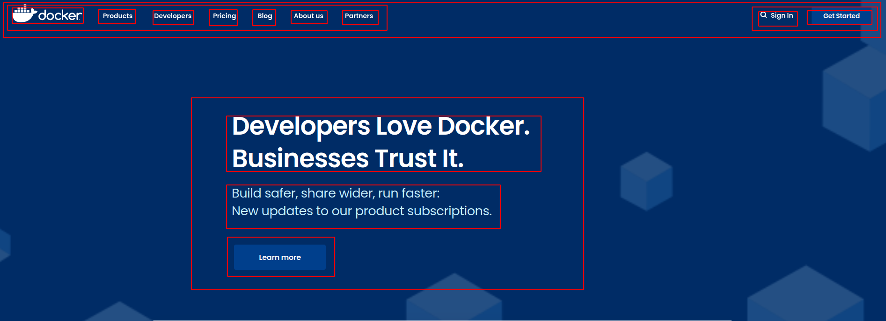
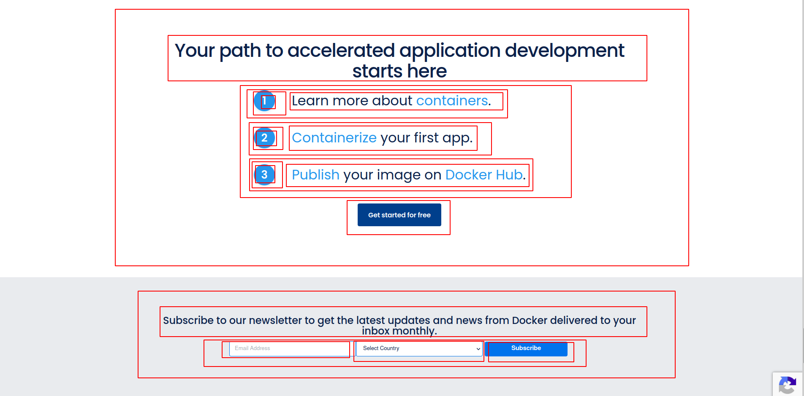
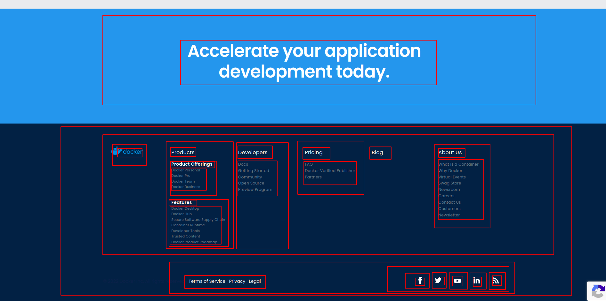

### [kubernetes.io](https://kubernetes.io/ru/)
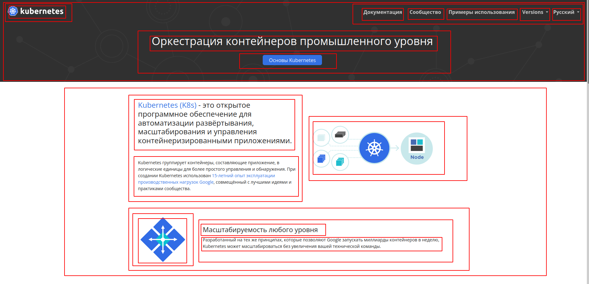
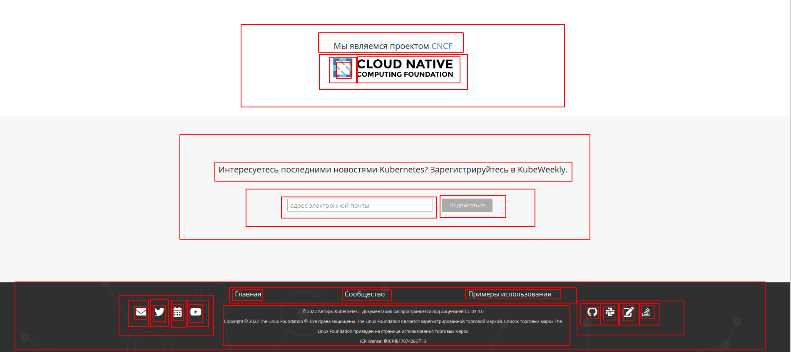

### [ubuntu.com](https://ubuntu.com/)
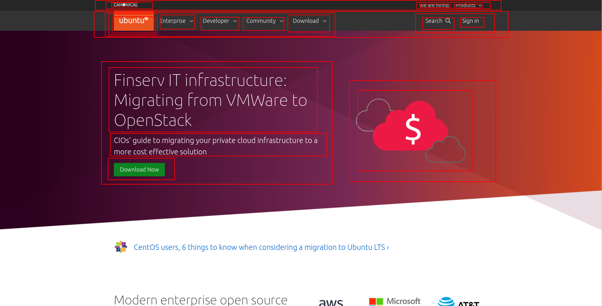
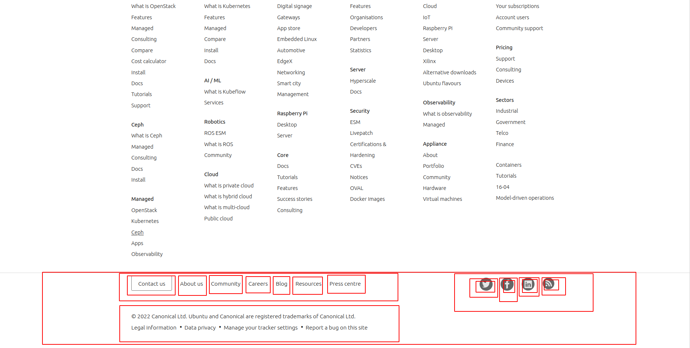

### [goharbor.io](https://goharbor.io/)
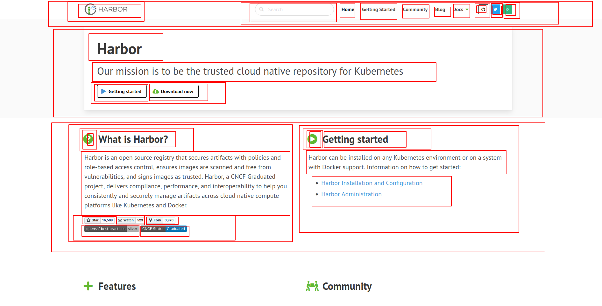
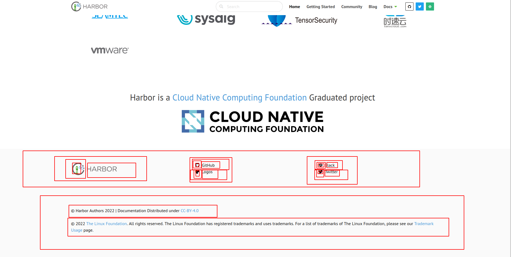

### [jenkins.io](https://www.jenkins.io/)
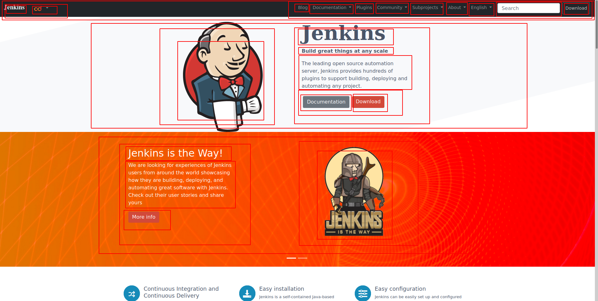
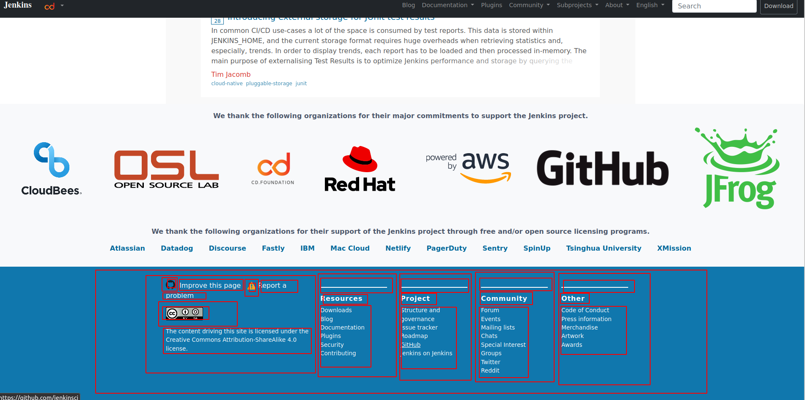
